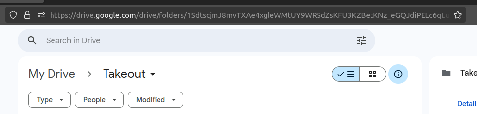

> 🚨 This is a work in progress

# Google Takeout Sucks

Google Takeout allows you to generate zip files of your google data. The problem is that it will generate hundreds of zip files of your data, and it sucks downloading it if these files are 50GB.

I made this script to download all of my stuff from Google Takeout

Before you begin, export all of your google photos to google drive using [Google Takeout](https://takeout.google.com/settings/takeout/custom/photos).

### Setup

1. Use Google takeout to export zip files to your Google Drive.

1. Install the script with `go install ...` Optionally, build with `go build ...`

1. Run `takeout login`. This will fetch an access token to READ your google drive files. This is necessary to download all of your Google takeout files to your harddrive

1. Copy the directory ID of the google takeout folder in google drive. This can be found in the URL when viewing the Takeout folder in google drive. `drive.google.com/drive/folders/{really long id....}`
   

1. Run the `takeout download --directoryId=<direcotryId> --outDir=<absolute/path/to/save/files>`. By default, `--dryRun` is set to false.

1. You can unzip all of the zip files with `takeout unzip --source=<absolute/path/to/zipfiles> --outDir=<absolute/path/to/unzip/files`. By default `--dryRun` is set to false
